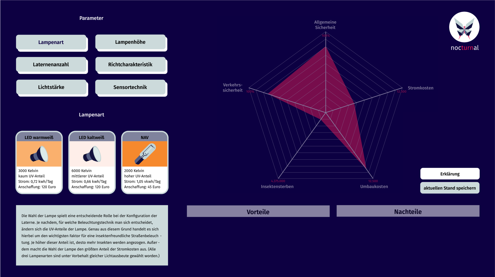

### p2-p_interactive-simulation khaylo_pehr_schulz

## Was ist nocturnal?

Bei nocturnal handelt es sich um ein Planungstool, welches Kommunalpolitikern dabei unterstützen soll, Straßenbeleuchtungen insektenfreundlicher zu gestalten und somit die Biodiversität zu schützen. Die Simulation zeigt einem, wie sich einzelne Veränderungen der Straßenbeleuchtung auf Faktoren wie Strom- und Umbaukosten, Insektensterben, Verkehrssicherheit und allgemeine Sicherheit auswirken.

## Vom Problem zur Idee

Der Begriff Lichtverschmutzung wird derzeit immer populärer. Trotzdem ist den wenigsten Leuten bewusst, wie sich die ansteigende Lichtverschmutzung auf die Insekten auswirkt. Genau dort liegt nämlich das Problem. Insekten werden von der UV-Strahlung des Lichtes angezogen werden und sterben dann zuhauf an mehreren Folgen unter den Laternen. Auch wenn sich dieses Problem im Einzelfall recht harmlos anhört, hat es trotzdem immense Folgen vor allem in Bezug auf die enorme Anzahl an Straßenbeleuchtungen. Wird die Gefährdung der Biodiversität nicht aufgehalten, so wird in naher Zukunft die Erde inklusive der Menschen unter den Auswirkungen sehr stark leiden.
Genau aus diesem Grund haben wir es uns als Team zur Aufgabe gemacht, tiefer in die Thematik einzutauchen, um Lösungen für dieses Problem zu finden. Hier kommt unser Projekt "nocturnal" ins Spiel. Wir zeigen mit unserer Simulation anhand von mehreren regulierbaren Parametern, wie es gelingt, die Laternen so insektenfreundlich wie möglich zu gestalten und geben den Verantwortlichen Tipps und Ratschläge mit auf den Weg.

## Ablauf der Simulation

Um die Simulation zu starten, muss zuerst der Weblink der Anwendung im Browser geöffnet werden (https://imd-cc2-2022-ss.h-da.io/team-5/p2-p_interactive-simulation-khaylo_pehr_schulz/). Bei der Simulation handelt es sich um eine für den Desktop optimierte Anwendung.

Sobald die Anwendung gestartet ist, wird man direkt zu Beginn erstmal mit dem Logo begrüßt, welches für eine kurze Zeit eingeblendet wird.
Nachdem das Logo verschwindet, gelingt man in den sogenannten „Start-Screen“. Dort hat man die Wahl zwischen zwei verschiedenen Buttons. Zum einen kann man sich dank des „Erklärung“-Buttons die allgemeine Simulationserklärung anzeigen lassen, welche einem die Thematik in Kürze etwas näher bringt und den Nutzen der Simulation knapp beschreibt. Außerdem befindet sich auf dem Start-Screen noch der „Start“-Button. Dieser leitet den Nutzer per Klick unverzüglich in den "Simulations-Screen" und damit dem Haupt-Screen der Anwendung.
Um den Nutzer nicht unwissend ins kalte Wasser zu werfen, wird ihm prompt nach dem Start des Simulations-Screens ein Tutorial angeboten. Dort hat man die Wahl zwischen zwei verschiedenen Buttons. Entweder man startet das Planungstool ohne den Durchlauf eines Tutorials oder man entscheidet sich dafür ein Tutorial in Anspruch zu nehmen, um den Aufbau und Ablauf des Tools besser zu verstehen. Da nicht jedes Feature innerhalb der Simulation auf den ersten Blick ersichtlich ist, wäre die Durchführung des Tutorials definitiv ratsam. Sobald man diese Entscheidung überwunden hat, fängt die eigentliche Simulation erst richtig an. Ab hier hat man die Möglichkeit, seine eigene Laternenkonfiguration zusammenzustellen. Während diesem Prozess wird man mithilfe des Textfelds und der Auflistung der Vor- und Nachteile beratend unterstützt. Sobald man seine Laterne fertig konfiguriert hat, wird einem auf der rechten Seite die Auswirkungen der gewählten Konfiguration in einem Netzdiagramm visualisiert. Dort bekommt man einen direkten Eindruck darüber, wie gut oder schlecht die Gesamtkonfiguration in Bezug auf unterschiedliche Output-Parameter ist. Um dort genauere Daten abzurufen, kann man über den jeweiligen Output-Parameter hovern. Daraufhin taucht ein kleines Fenster auf, mit einer genauen Anzahl der Daten auf.

## Aufbau der Simulation

### Parameter & Variationen

Im oberen linken Bereich des Planungstools befinden sich sechs verschiedene Parameter. Diese sind verpackt in einzelne Buttons und lassen sich anklicken. Sobald man einen der Buttons angeklickt hat, unterteilt sich der jeweilige Parameter nochmals in zwei bis 3 verschieden Variationen. Diese befinden sich innerhalb der Boxen und sind jeweils mit einer Illustration zur Veranschaulichung ausgestattet. Wenn man sich für einen der Variationen entschieden hat, kann man die Box anklicken und der Parameter wird „eingeloggt“, was sich an der Farbänderung der obigen Parameter-Buttons erkennen lässt.

### Erklärungsfeld

Im unteren linken Bereich findet man ein Textfeld mit einem Text. Dieser steht in Relation mit dem ausgewählten Parameter und zeigt eine kurze Beschreibung zu ihm an. Das bedeutet, dass sobald man einen anderen Parameter-Button auswählt, werden unterschiedliche Texte ausgegeben, sodass der Nutzer sich ein Bild davon machen kann, um was es sich bei der jeweiligen Parameterwahl genau handelt.

### Consulting Bereich

Rechts neben der Parametererklärung befinden sich dann weitere Vor- und Nachteile. Diese beziehen sich jedoch im Gegensatz zum Text nicht auf die Parameter selbst, sondern auf die einzelnen Auswahlmöglichkeiten innerhalb der Parameter Boxen. Dort bekommt man schonmal einen groben Einblick darüber, wie positiv oder negativ sich die jeweilige Entscheidung auf die Gesamtkonfiguration auswirkt.

### Netzdiagramm

Im rechten Bereich des Planungstools, findet sich das Netzdiagramm wieder. Dort werden fünf verschiedene Output-Parameter veranschaulicht und zeigen einem die Auswirkungen seiner getätigten Laternenkonfiguration. Man bekommt hierbei Auskunft über Strom- und Umbaukosten, Insektensterben, Verkehrssicherheit und allgemeine Sicherheit. Das Diagramm ist zu Beginn der Simulation ausgegraut und entwickelt sich erst, wenn man alle Parameter inklusive der Variationen konfiguriert hat. Bei den äußeren Skalen handelt es sich um die möglichen Maximalwerte. Da es sich bei dem Chart um eine recht grobe Darstellungsweise handelt, ist es zudem möglich sich genaue Daten eines einzelnen Parameters ausgeben zu lassen indem man über ihn hovert.

### Buttons & Endanzeige

Rechts neben dem Diagramm befinden sich außerdem noch zwei weitere Buttons. Zum einen der „Erklärung“-Button, mit welchem man sich nochmal die allgemeine Simulationserklärung aufrufen kann. Zum anderen der „aktuellen Stand speichern“-Button, welcher ebenfalls wie auch das Netzdiagramm erst freigeschaltet wird, wenn alle Parameter einmal durch konfiguriert worden sind. Dieser Button führt einen dann unverzüglich zu einer Art Gesamtübersicht der gewählten Laternenkonfiguration. Dort wird einem nochmal alles zusammengefasst, wie beispielsweise die gewählten Parametervariationen sowie die Auswirkungen auf die Output-Parameter in Textformat und im Netzdiagramm. Falls man mit seinen Entscheidungen unzufrieden ist, kann man über den „zurück zur Simulation“-Button unten links erneut Änderungen vornehmen.

### Links

zum Trailer: https://vimeo.com/manage/videos/731329094

### Lizenzen

Lizenz für Schriftschnitte:
/\*\*

- @license
-
- Font Family: Fira Sans
- Designed by: Carrois Apostrophe
- URL: https://www.fontshare.com/fonts/fira-sans
- © 2022 Indian Type Foundry
-
- Font Styles:
- Fira Sans Regular
- Fira Sans Medium
- Fira Sans Semi Bold
- \*/
